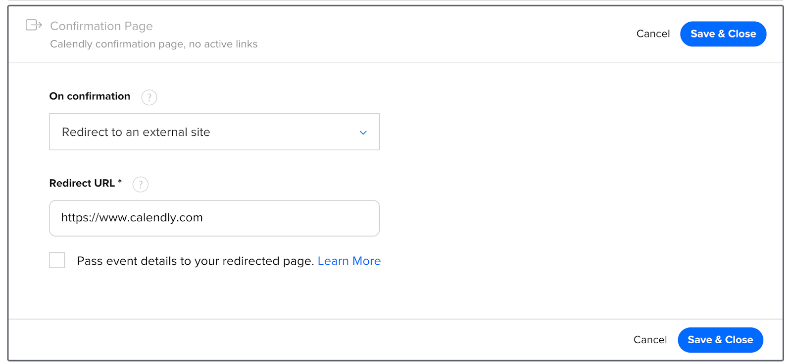

# Working with FirstPromoter and Calendly

This integration is for users who have custom websites and have Calendly added. **You must be on the Calendly Professional Plan. It also requires you to have a thank-you page, which you will redirect to after a user books an appointment.**

&nbsp;

## Main tracking script

1. On your website, add the below scripts to all your landing or marketing pages. Preferably in the head section of your entire website or on your landing pages.

```html
<script>(function(w){w.fpr=w.fpr||function(){w.fpr.q = w.fpr.q||[];w.fpr.q[arguments[0]=='set'?'unshift':'push'](arguments);};})(window);
fpr("init", {cid:"==cid=here=="}); 
fpr("click");
</script>
<script src="https://cdn.firstpromoter.com/fpr.js" async></script>
```

2. Go to your Calendly home page
3. Select the desired event.
4. Expand the **Confirmation Page** section.
5. In the “On confirmation” section, choose “**Redirect to an external site**”.
   

6. Enter your “Thank You” page URL in the **Redirect URL** section.
7. Check the option “**Pass event details to your redirected page**” to include the lead's email in the “Thank You” page URL.
8. Click Save & Close.

### Test Click Tracking

@[trackingtest]("click")

## Referral tracking script

Add the below script to your thank-you page preferably in the head section.

```html
<script>(function(w){w.fpr=w.fpr||function(){w.fpr.q = w.fpr.q||[];w.fpr.q[arguments[0]=='set'?'unshift':'push'](arguments);};})(window);
fpr("init", {cid:"==cid=here=="}); 
fpr("click");
</script>
<script src="https://cdn.firstpromoter.com/fpr.js" async></script>
<script>
    function sendReferralToFirstPromoter() {
        if (window.fpr) {
            var urlString = decodeURI(window.location.href);
            var emailFromUrl = new URLSearchParams(urlString).get("invitee_email");
            if (emailFromUrl) {
                fpr("referral", { email: emailFromUrl });
            }
        }
    } 
    if (window.attachEvent) {
        window.attachEvent("onload", sendReferralToFirstPromoter);
    } 
    else {
        window.addEventListener("load", sendReferralToFirstPromoter, false);
    }
</script>
```

### Test Referral Tracking

@[trackingtest]("referral")
