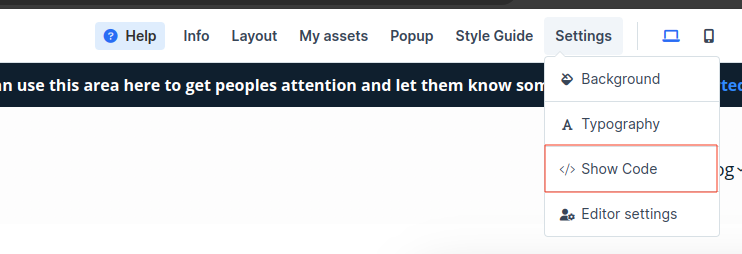

# Adding FirstPromoter to your ClickFunnels website

Setting up FirstPromoter with ClickFunnels mainly requires you to add a predesigned script to get started

&nbsp;

## Tracking script

### Adding the scripts to your ClickFunnels website

1. Go to your ClickFunnels Dashboard.
2. Select sites > Overview > Customize > Select Settings in the top bar > show code.

    

    **For specific funnels pages**

    Select Sites > Pages > Funnel Pages > click on the page you want to add the scripts to >Select Settings in the top bar > show code

3. Copy and paste the below code into the head tracking code section

```html
<script>(function(w){w.fpr=w.fpr||function(){w.fpr.q = w.fpr.q||[];w.fpr.q[arguments[0]=='set'?'unshift':'push'](arguments);};})(window);
fpr("init", {cid:"==cid=here=="}); 
fpr("click");
</script>
<script src="https://cdn.firstpromoter.com/fpr.clickfunnels.js" async></script>
```

### Test Click Tracking

@[trackingtest]("click")

### Test Referral Tracking

@[trackingtest]("referral")
